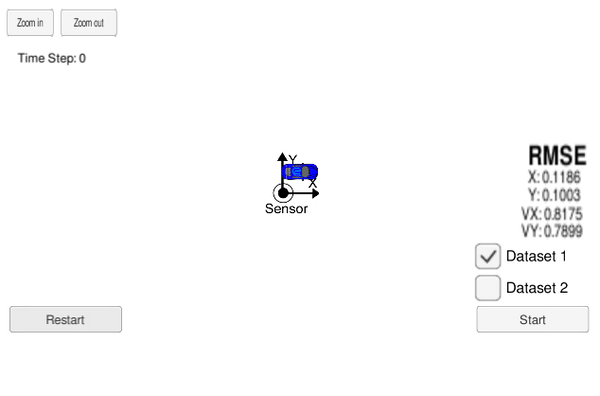

# Extended Kalman Filter

In this project, an extended Kalman filter is used to estimate the state of a moving object of interest with noisy lidar and radar measurements. In the gif below, the red dots are radar measurements, the blue dots are lidar measurements, and the green dots are estimated positions of the car using an extended Kalman filter.



## Setup

* Download the [simulator](https://github.com/udacity/self-driving-car-sim/releases), which the extended Kalman filter code interfaces with.
* Install uWebSockets by running the `install-linux.sh` script.
  ```bash
  ./install-linux.sh
  ```
* Build the extended Kalman filter source code.
  ```bash
  mkdir build
  cd build
  cmake ..
  make
  ```

## Run

* Run the extended Kalman filter binary.
  ```bash
  ./build/ExtendedKF
  ```
* Open the simulator.
  ```bash
  ./term2_sim.x86_64
  ```
* Select "Project 1/2: EKF and UKF" from the simulator.
* Check "Dataset 1" in the simulator and press "Start".
